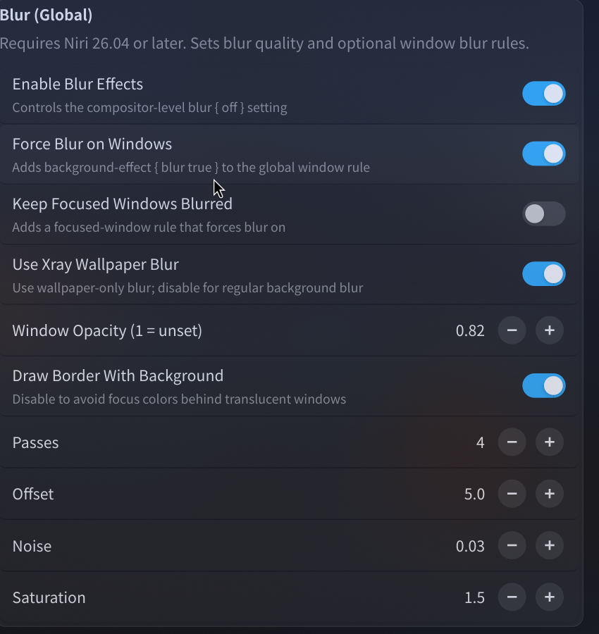

# niri
## 安装niri
https://github.com/niri-wm/niri

## niri可视化配置软件
https://github.com/srinivasr/nirimod


## nirimod配置文件



## 没有网络连接快捷方式
```shell
cat <<EOF > ~/.local/share/applications/nm-connection-editor.desktop
[Desktop Entry]
Name=Network Connections
Name[zh_CN]=网络连接设置
Comment=Manage and configure your network connections
Exec=nm-connection-editor
Icon=preferences-system-network
Terminal=false
Type=Application
Categories=Settings;Network;
StartupNotify=true
EOF
```